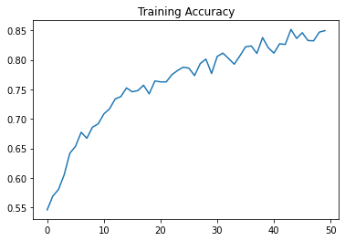

# Cats VS Dogs

A CNN to distinguish between cats and dogs.   

Training set of 2000 images, 1000 images of cats and dogs each.

### Accuracy

Gives a training accuracy of 84% and validation accuracy of 83% over 50 epochs
> Trained on Google Colab

---

### Visualizations

