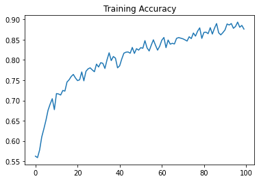
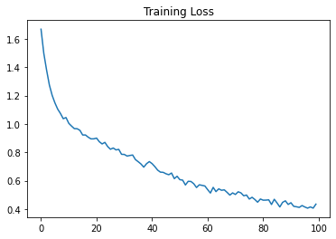
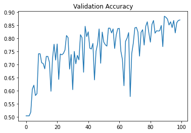
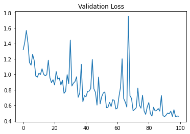
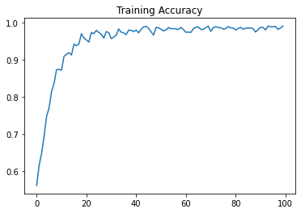
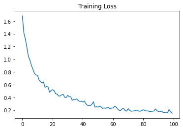
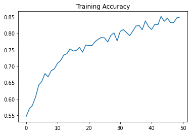
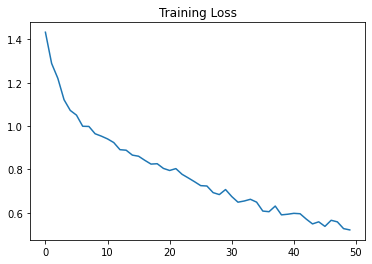
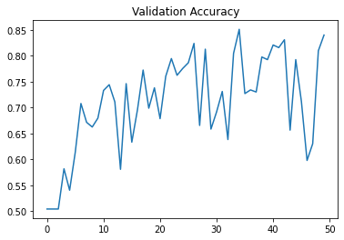
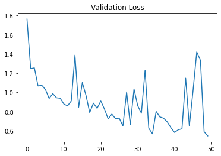

# Cats VS Dogs

A CNN to distinguish between cats and dogs.  

Training set of 2000 images, 1000 images of cats and dogs each.

## Accuracies

**100 epochs**

>With Augmentation

Gives a training accuracy of 89% and a validation accuracy of 87.1%

    
    
    
    

>Without Augmentation

Give a training accuracy of 99% and validation accuracy of 76%

    
    

**50 epochs**

>Without Augmentation

Gives a training accuracy of 85% and validation accuracy of 84%

    
    
    
    

> Trained on Google Colab

## Code

Cats_vs_Dogs_model2.ipynb (50 epochs)
